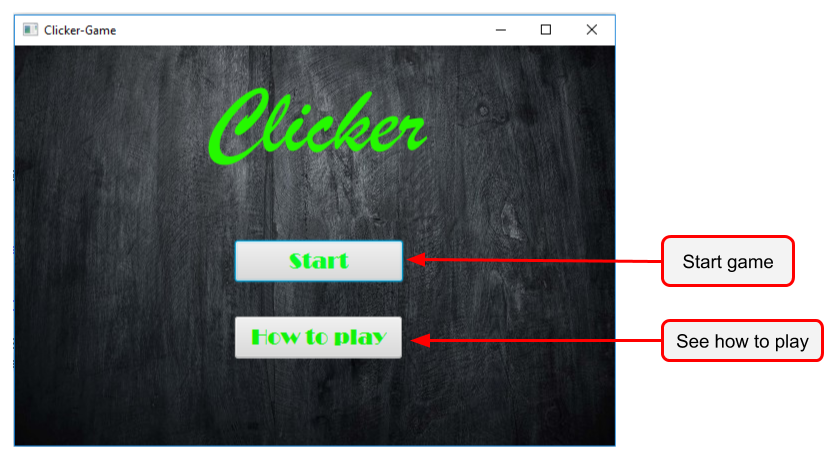
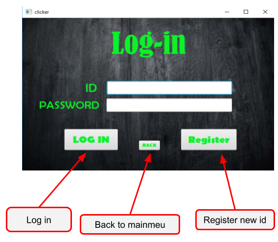
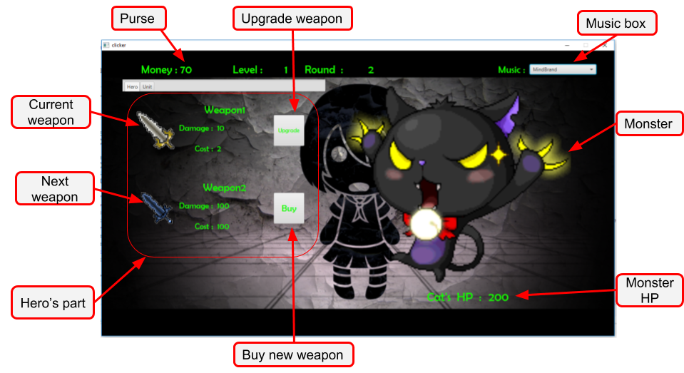
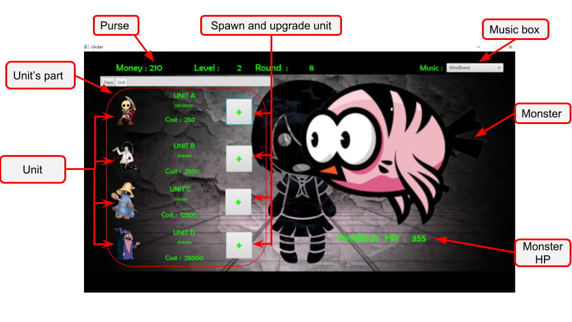

# Clicker Game

[**Github Page**](https://jp-ske15.github.io/Project2-Clicker-Game/)

**Contents**

- [Detail](#detail-of-clicker-game)
- [Game Feature](#game-feature)
- [Technology and Knowledge](#technology-and-knowledge-that-i-used)
- [How to install](#how-to-install)
- [Contributors](#contributors)

## Detail of clicker game
Clicker game is game that player need to gain money from killing monster.if player have money enough.player can buy new weapon, upgrade weapon, spawn new unit and upgrade unit.

## Game Feature
**main menu window.**

**Log-in window.** window that contain log-in and register part,player can register new id or if player already have id, game will continue.

**Game window [hero part].** player can upgrade weapon or buy new weapon in this part.

**Game window [unit part].** player can spawn unit or upgrade unit in this part.

**Game will auto save when player close window**

### Packages
- **Alert** Contains alert box  interface with message.
- **Register** Contains database's part.
- **monsterANDmoney**  Contains money and monster activity class and enum for storage monster.
- **music** Folder for music file.
- **picture** Folder for picture file.
- **sound** Contains Playing sound class.
- **uiANDcontroller** Contains all of UI and Controller class for this project.
- **unitANDhero** Contains unit and hero activity

## Technology and Knowledge that I used

### JavaFX
for user interface.

### SQLite
for database

### Patterns
In this project, I use
- **Observer Pattern**: Use for update and show value for purse, monsterHP, etc.
- **Singleton Pattern**: Use for make easy way to get data for setting game.
 
### Enum
 Use to storage unit, music, weapon and monster data

## How to install

You need: 

	- Java ver. 8 or newer

	- Clicker-Game.jar

To run the file: 

1. Click 'Clicker-Game.jar in folder "GAME"  above to download or click [here](https://github.com/JP-SKE15/Project2-Clicker/blob/master/GAME/Clicker Game.jar).
2. Runs 'Clicker-Game.jar' file

## Contributor

- [**Hayato Kawai**](https://github.com/JP-SKE15) 6010545978
